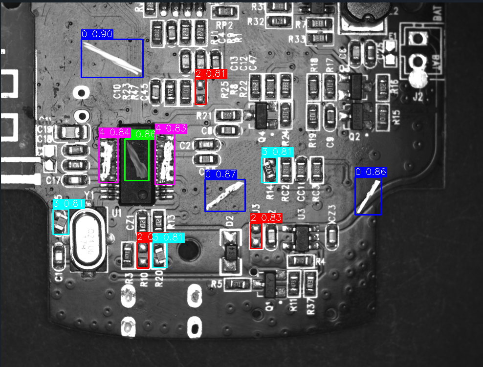

## YOLO Object Detection with OpenCV and Supervision

# Description
This project leverages the YOLO model to detect objects within images, drawing bounding boxes around each detected object and adding confidence labels. The high accuracy and performance of YOLO make it ideal for real-time object detection applications. Using a custom dataset, the project aims to detect and classify defects in electronic components during manufacturing and assembly. The dataset includes images of circuit boards with various defect types, enabling AI engineers and developers to train models for automated defect detection and diagnosis, ultimately improving the efficiency and accuracy of quality control processes.

# Contents
The dataset contains images of electronic circuit boards captured in a production testing environment, with defects categorized into five distinct types:

- **Lable 0** - Surface scratches on the circuit board
- **Label 1** - Scratches on component surfaces
- **Label 2** - Missing components
- **Label 3** - Damaged components
- **Label 4** - Component pin defects

# Data Format
- **Images**: Each image contains circuit boards with defect regions marked by bounding boxes in different colors, representing each defect type.
- **Annotations**: Accompanying annotation files (in CSV or JSON format) provide detailed information on the location and type of defect for each image.

# Result Example
<table align="center">
  <tr>
    <td align="center">
      
      <br>Input Image
    </td>
    <td align="center">
      
      <br>Output Image
    </td>
  </tr>
</table>

# Libraries Used
- **OpenCV**: A powerful library for image and video processing.
- **YOLO (Ultralytics)**: A fast and accurate object detection model.
- **Supervision**: Provides annotation support for images.

# Project Structure
```
├── data/                     # Folder containing input images to be processed
├── images/                   # Folder for saving processed images with annotations
├── yolo11m_trained.pt        # Pre-trained YOLO model file
├── main.py                   # Main source code
├── requirements.txt          # Required libraries
└── README.md                 # Project documentation and instructions
```

# Installation

1. **Clone the repository**:
   ```bash
   git clone https://github.com/HXSang/Yolov11_ObjectDetection.git
   cd Yolov11_ObjectDetection
   ```

2. **Install the required libraries**:
   Use `pip` to install the necessary packages:
   ```bash
   pip install opencv-python ultralytics supervision
   pip install -r requirements.txt
   ```

3. **Prepare the YOLO model**:
   - Download the pre-trained YOLO model (`yolo11m_trained.pt`) and place it in the project folder.

# Usage

- Place input images in the `data/` folder.
- Run the `main.py` file to start processing and save the output images in the `images/` folder.

```bash
python main.py
```

# Code Details

- **Load YOLO Model**: Use the pre-trained YOLO model for object detection.
- **Draw Bounding Boxes and Labels**: Use OpenCV to draw bounding boxes with different colors based on the object class and add labels for each detected object with confidence scores.
- **Batch Processing**: Iterate through each image in the input folder, process it, and save the annotated image to the output folder.

# Results
The script outputs statistics on the number of successfully processed images and any errors encountered during detection.

# Contributions
All contributions are welcome! Please feel free to open a Pull Request or create an Issue if you'd like to suggest enhancements or add features.
